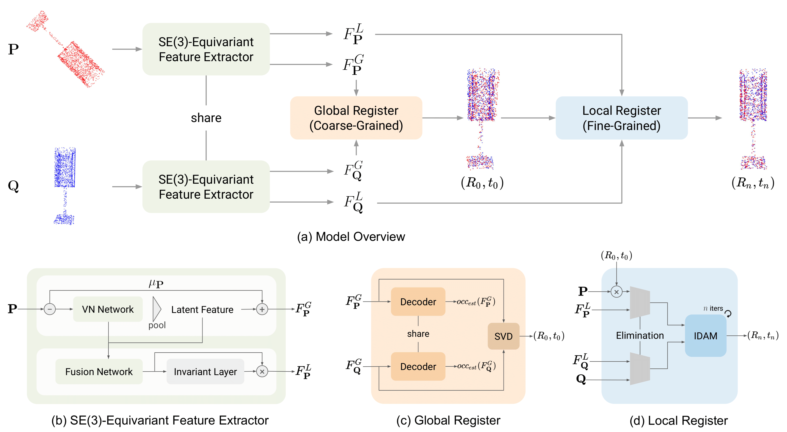

Coarse-to-Fine Registration with SE(3)-Equivariant Representations
==================================================================

This is the official code repository for ICRA 2023 paper, Coarse-to-Fine Registration with SE(3)-Equivariant Representations [[arxiv]](https://arxiv.org/abs/2210.02045).

Preprocessed Dataset
--------------------
[ModelNet40 with occupancy labels](https://drive.google.com/drive/folders/1zIJAj8131hfO_KWDkF6TFiAY7Te4Bk99?usp=sharing)

Train
-----
    $ python train.py

Demo
----
    $ python demo.py --weights [checkpoints]

Installation
------------
    $ conda create -n cfreg python=3.8
    $ conda install pytorch=1.9.0 cudatoolkit=11.1 -c pytorch -c nvidia
    $ pip install -r requirement.txt

Citation
--------
If you want to use it in your work, please cite it as

    @inproceedings{lin2023coarse,
      title={Coarse-to-fine point cloud registration with se (3)-equivariant representations},
      author={Lin, Cheng-Wei and Chen, Tung-I and Lee, Hsin-Ying and Chen, Wen-Chin and Hsu, Winston H},
      booktitle={2023 IEEE International Conference on Robotics and Automation (ICRA)},
      pages={2833--2840},
      year={2023},
      organization={IEEE}
    }
